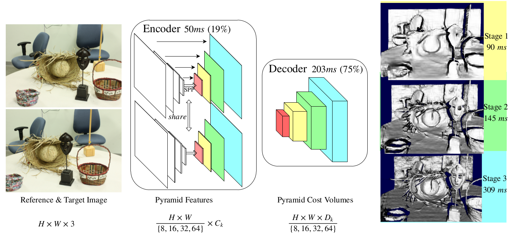
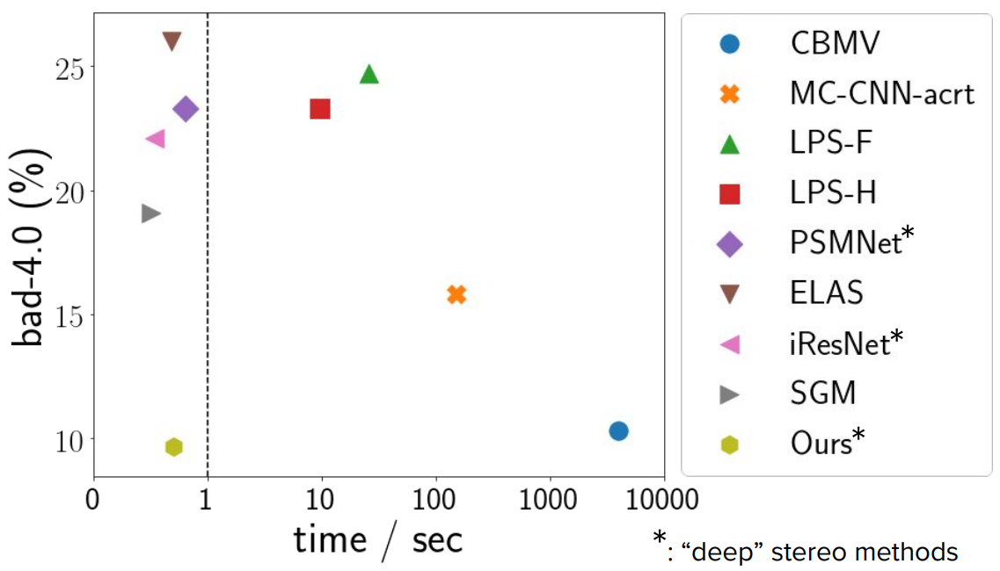
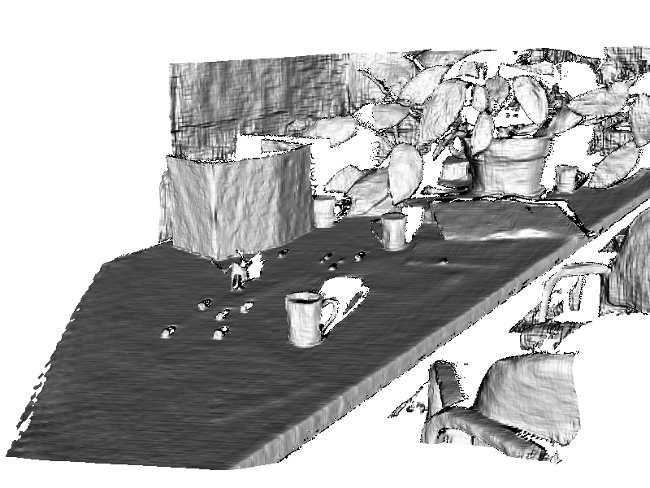
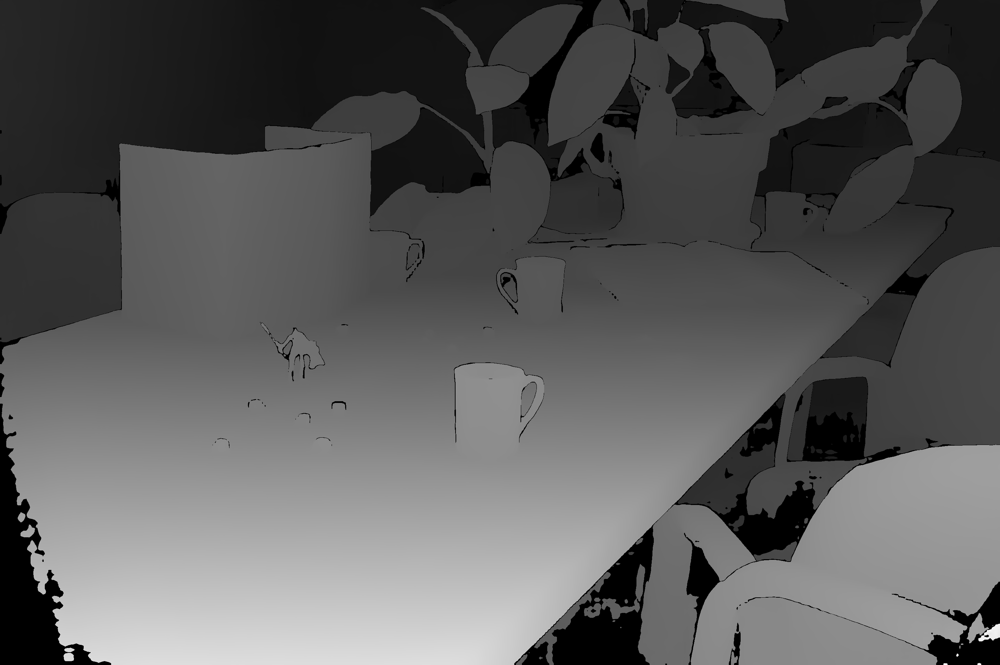
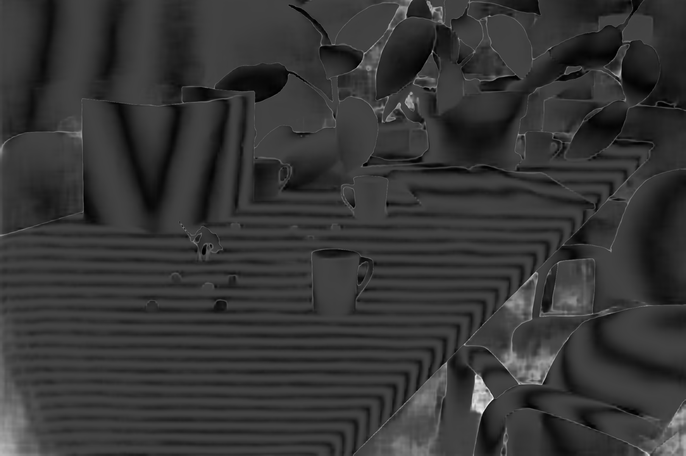

# Hierarchical Deep Stereo Matching on High Resolution Images
### [[project webpage](http://www.contrib.andrew.cmu.edu/~gengshay/cvpr19stereo)]



Qualitative results on Middlebury:
 


Performance on Middlebury benchmark (y-axis: error, the lower the better):



Able to handle large view variation of high-res images (as a submodule in [Open4D, CVPR 2020](https://www.youtube.com/watch?v=sq2hhkHgtb0)): 


## Requirements
- tested with python 2.7.15 and 3.6.8
- tested with pytorch 0.4.0, 0.4.1 and 1.0.0
- a few packages need to be installed, for eamxple, texttable

## Weights

- [Middlebury model (more robust)](https://github.com/gengshan-y/high-res-stereo/blob/www/final-768px.tar)
- [KITTI model (specialized to KITTI)](https://github.com/gengshan-y/high-res-stereo/blob/www/kitti.tar)
- [Google drive (backup link)](https://drive.google.com/file/d/1BlH7IafX-X0A5kFPd50WkZXqxo0_gtoI/view?usp=sharing)

Note: The .tar file can be directly loaded in pytorch. No need to uncompress it.

## Inference
Test on CrusadeP and dancing stereo pairs:
```
CUDA_VISIBLE_DEVICES=3 python submission.py --datapath ./data-mbtest/   --outdir ./mboutput --loadmodel ./weights/final-768px.tar  --testres 1 --clean 1.0 --max_disp -1
```

Evaluate on Middlebury additional images:
```
CUDA_VISIBLE_DEVICES=3 python submission.py --datapath ./path_to_additional_images   --outdir ./output --loadmodel ./weights/final-768px.tar  --testres 0.5
python eval_mb.py --indir ./output --gtdir ./groundtruth_path
```

Evaluate on HRRS:
```
CUDA_VISIBLE_DEVICES=3 python submission.py --datapath ./data-HRRS/   --outdir ./output --loadmodel ./weights/final-768px.tar  --testres 0.5
python eval_disp.py --indir ./output --gtdir ./data-HRRS/
```

And use [cvkit](https://github.com/roboception/cvkit) to visualize in 3D.

## Example outputs

left image

3D projection

disparity map

uncertainty map (brighter->higher uncertainty)

## Parameters
- testres: 1 is full resolution, and 0.5 is half resolution, and so on
- max_disp: maximum disparity range to search
- clean: threshold of cleaning. clean=0 means removing all the pixels.

## Data

### train/val
- [Middlebury (train set and additional images)](https://drive.google.com/file/d/1jJVmGKTDElyKiTXoj6puiK4vUY9Ahya7/view?usp=sharing)
- [High-res-virtual-stereo (HR-VS)](https://drive.google.com/file/d/1SgEIrH_IQTKJOToUwR1rx4-237sThUqX/view?usp=sharing)
- [KITTI-2012&2015](http://www.cvlibs.net/datasets/kitti/eval_stereo.php)
- [SceneFlow](https://lmb.informatik.uni-freiburg.de/resources/datasets/SceneFlowDatasets.en.html)
- [Eth3D](https://www.eth3d.net/datasets#low-res-two-view-training-data)

### test
High-res-real-stereo (HR-RS) It has been taken off due to licensing issue. Please use the [Argoverse dataset](https://eval.ai/web/challenges/challenge-page/1704/overview).

## Train
1. Download and extract training data in folder /d/. Training data include Middlebury train set, HR-VS, KITTI-12/15, ETH3D, and SceneFlow.
2. Run
```
CUDA_VISIBLE_DEVICES=0,1,2,3 python train.py --maxdisp 384 --batchsize 28 --database /d/ --logname log1 --savemodel /somewhere/  --epochs 10
```
3. Evalute on Middlebury additional images and KITTI validation set. After 40k iterations, average error on Middlebury *additional* images excluding Shopvac (perfect+imperfect, 24 stereo pairs in total) with half-res should be around 5.7.

## Citation
```
@InProceedings{yang2019hsm,
author = {Yang, Gengshan and Manela, Joshua and Happold, Michael and Ramanan, Deva},
title = {Hierarchical Deep Stereo Matching on High-Resolution Images},
booktitle = {The IEEE Conference on Computer Vision and Pattern Recognition (CVPR)},
month = {June},
year = {2019}
}
```

## Acknowledgement
Part of the code is borrowed from [MiddEval-SDK](http://vision.middlebury.edu/stereo/submit3/), [PSMNet](https://github.com/JiaRenChang/PSMNet), [FlowNetPytorch](https://github.com/ClementPinard/FlowNetPytorch) and [pytorch-semseg](https://github.com/meetshah1995/pytorch-semseg).
Thanks [SorcererX](https://github.com/SorcererX/high-res-stereo) for fixing version compatibility issues.
